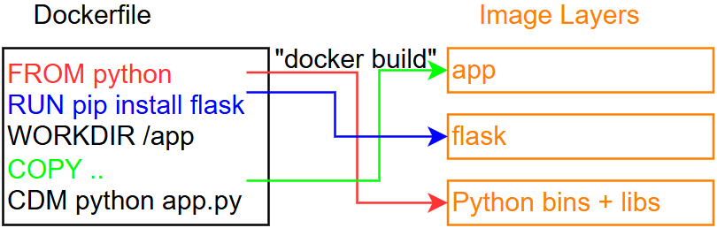
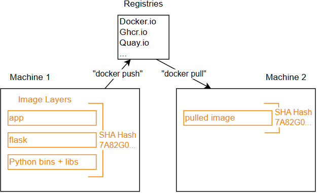
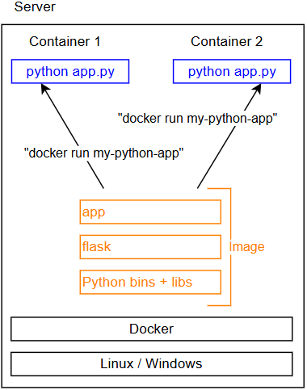

### Definitions

- Docker Image : universal app packager; Dockerfile is the set of instructions needed to create a container/Docker image.

  

  - An image is the application whereas the container is an instance of that image running as a process. One can have many containers running off the same image.

- Docker Registry : universal app distribution (DokerHub), stores docker images and facilitates their distribution. Able to take the software made on one machine with all of its dependencies and run it exactly the same way on another system (with possibly a different distribution).

  

- Docker Container : Identical runtime environments, isolates applications, prevents the application running on a container from seeing the rest of the operating system (similar to a VM but in reality are restricted processes running on the OS kernel).

  

These 3 features implement the docker/container workflow "Build → Ship → Run"

### Online resources

- https://opencontainers.org/
- https://www.docker.com/101-tutorial/
- https://app.docker.com/
- https://www.bretfisher.com/kubernetes-vs-docker/
- https://www.udemy.com/course/docker-mastery

# Docker

## Docker installation

1. download Docker Desktop (tool for cintainer development) from `https://www.docker.com/products/docker-desktop/` note that "Commercial use of Docker Desktop at a company of more than 250 employees OR more than $10 million in annual revenue requires a paid subscription (Pro, Team, or Business)."

   Docker/Container requires the container image to run on a kernel that was designed for it (i.e. linux on linux and windows on windows, etc.); Thus Docker Desktop will manage the setup, upgrading, deletion, and security of a tiny VM (small linux kernel and container file system) transparantly in the background (true for macOS and Windows).

2. install ubuntu from the microsoft store, open it and create a username/password.
3. got to `Docker Desktop > Setting > Resources > WSL Integration` and enable ubuntu (this can be done with any other linux distribution).
4. open ubuntu terminal and run commands to see if successfully downlaoded all. Note that commands will be in the format `docker <managment-command> <sub-command> (options)` (old but still working format `docker <sub-command> (options)`)
   1. `docker version` verified cli can talk to engine
   2. `docker info` displays most config values of engine

### VS Code extensions

- `Docker` https://marketplace.visualstudio.com/items?itemName=ms-azuretools.vscode-docker
- `Kubernetes` https://marketplace.visualstudio.com/items?itemName=ms-kubernetes-tools.vscode-kubernetes-tools
- `Remote Development` https://marketplace.visualstudio.com/items?itemName=ms-vscode-remote.vscode-remote-extensionpack
- `Live Share` https://marketplace.visualstudio.com/items?itemName=MS-vsliveshare.vsliveshare

## Container Basics

The command `docker container run --publish 80:80 --detach --name helloWorld nginx`

1. Looks for the specified image, `nginx`, locally in image cache, doesnt find anything.
2. Looks in remote image repository (defaults to Docker Hub)
3. Downloads the latest version (`nginx:latest` by default)
4. Creates a new container based on that image inside docker engine (with name `helloWorld`). Note that names have to be unique
5. Gives it a virtual IP on a private netwrok inside docker engine
6. Opens up port `80:` on host and forwards to port `:80` in container
7. Starts conainer by using the CMD in the image Dockerfile

Run a `nginx`, `mysql`, and `httpd` (apache) server all in `--detach` and name them appropriately. nginx should listne on `80:80`, mysql on `3306:3306`, and httpd on `8080:80`. When running mysql, pass in `MYSQL_RANDOM_ROOT_PASSWORD=yes`, and use the `docker container logs` on mysql to find the random password it created on startup. Clean it all up with `docker container stop` and `docker container rm` (both can accept multiple names or IDs). Use `docker container ls` to ensure everything is correct before and after cleanup.

1. `docker container ls`
2. `docker container run -p 80:80 --name nginx -d nginx`
3. `docker container run -p 8080:80 --name httpd -d httpd`
4. `docker container run -p 3306:3306 --name mysql --env MYSQL_RANDOM_ROOT_PASSWORD=yes -d mysql`
5. `docker container logs mysql | grep "PASSWORD"`
6. `docker container ls`
7. `docker container stop nginx httpd mysql`
8. `docker container rm nginx httpd mysql`

`docker container run -it` starts a container interactively while `docker contianer exec -it` connects to a shell inside of an already running container.

Use different linux distro (`centos:7` and `ubuntu:14.04`) containers to check curl cli tool version (using `-it` and `docker container run --rm`).

1. `docker container run --rm` "Automatically remove the container and its associated anonymous volumes when it exits" (using `docker container run --help`)
2. `docker container run --rm -it centos:7 bash`
   - `$ curl --version` (already updated/installed)
3. `docker container run --rm -it ubuntu:14.04 bash`
   - `$ apt-get update && apt-get install curl` (needs to be installed)
   - `$ curl --version`

### Docker Networks

Ever since Docker engine 1.11, multiple containers on a created network can respond to the same DNS address. This meanas that a DNS Round Robin can be created. To do this, create a new virtual network (default bridge driver) and create 2 containers from `elasticsearch:2` image. Use `--network-alias search` when creating them to give them an additional DNS name to respond to. Run `alpine nslookup search` to see the 2 containers list for the same DNS name. Run `alpine curl -s search:9200` multiple times until you see both "name" fields show.

1. `docker network create --driver bridge round_robin_dns` creates a new virtual network with the default "bridge" driver (builds virtual network locally with its own subnet at 172.17.\*, 172.18.\*, ...).
   - `docker network ls` lists all netwroks, ensures that the netwrok was indeed created.
2. `docker container run --network-alias search --network round_robin_dns --name container1 -d elasticsearch:2` creates and run container in the background with the network alias of "search" connected straight to the "round_robin_dns" local network.
3. `docker container run --name container2 -d elasticsearch:2` creates and run container in the background NOT connected to the "round_robin_dns" local network (aliases are only supported for user-defined networks).
4. `docker network connect --alias search round_robin_dns container2` connects the un-connected container2 to the "round_robin_dns" local network with the alias "search".
   - `docker network inspect round_robin_dns` displays network information for "round_robin_dns", ensures that both containers are connected to the created local network. NOTE THE "IPv4Address" OF EACH CONTAINER.
5. `docker container run --rm --network round_robin_dns -it alpine sh` create an interactive shell container using alpine (linux) that is connected to the user-defined network "round_robin_dns" (so will have access to DNS containing the containers with their alias "search").
   - `$ nslookup search` "Query DNS about HOST", the displayed "Address" should match the containers'
6. - `$ apk update; apk upgrade; apk add curl` to install `curl` on `alpine`
   - `$ curl -s search:9200` x n or until name variable is different (meaning that a different container was accessed)
   - `$ exit`
7. `docker network disconect round_robin_dns container1` disconnects the connected container1 from the "round_robin_dns" local network.
8. `docker container stop container1 container2` stops the running containers.
9. `docker container rm container1 container2` removes the containers.
10. `docker network rm round_robin_dns` removes the user-defined network.

## Image Basics

Every image starts from the very beginning with a blank layer called "scratch"; then, every set of changes that happens after that on the file system, in the image, is another layer (can be seen by running `docker history image:latest`). These layers are only ever stored once on the file system, meaning that images which use the same layers share them (upload/download only missing layers).

When running a container off of an image, Docker creates a new read/write layer for that container ontop of the image. The storage drive that is used by Docker layers these changes ontop of each other to create the final image/container. When a container/layer changes files from the underlying layers, Docker copies and stores the changed files in the container layer (copy-on-write)

`docker image inspect image` returns the image's metadata.

https://docs.docker.com/reference/dockerfile/

"Dockerize a Node.js app". Make a Dockerfile, Build it, Test it, Push it, (rm it), Run it (iterative process).

```Dockerfile
FROM node:6-alpine
EXPOSE 3000
RUN apk add --no-cache tini
WORKDIR /usr/src/app
COPY package.json package.json
RUN npm install && npm cache clean --force
COPY . .
CMD [ "/sbin/tini", "--", "node", "./bin/www" ]
```

- `docker image build -t testnode .` BUILD
- `docker container run -p 80:3000 --rm testnode` TEST
- `docker tag testnode rashri/testnode` change tag to fit username
- `docker push rashri/testnode` upload image to repository
- `docker image rm rashri/testnode` delete local image
- `docker container run -p 80:3000 --rm rashri/testnode` test container works when installing it from repository

### Re-taging images

1. `docker image tag ubuntu:14.04 rashri/ubuntu:14.04` creates a tag TARGET_IMAGE that refers to SOURCE_IMAGE
2. `docker push rashri/ubuntu:14.04` uploads image to repository (public)
   - if I want to create a private repository; in dockerHub, create a repository and specify it as private before running the push command

## Docker Volumes

"Containerize Jekyll". Follow the requirments and instructions for https://jekyllrb.com/ so that a jekyll website can be entered as a bind mount (file/directory on host machine is mounted into a container).

Dockerfile :

```Dockerfile
FROM alpine:latest

# Prerequisites from https://jekyllrb.com/docs/installation/#requirements
RUN apk update; apk upgrade; apk add build-base ruby-dev ruby
# install the jekyll and blunder gems
RUN gem install jekyll bundler && gem cleanup
# copy entrypoint bash script to local
COPY entrypoint.sh /usr/local/bin
# enter volume where jekyll site was created
WORKDIR /site
EXPOSE 4000
# run the bash script which would run bundle install
ENTRYPOINT [ "entrypoint.sh"]
# run the command bundle exec jekyll serve --force_polling -H 0.0.0.0 -P 4000
CMD [ "bundle", "exec", "jekyll", "serve", "--force_polling", "-H", "0.0.0.0", "-P", "4000" ]
```

entrypoint.sh :

```bash
#!/bin/sh
bundle install --retry 5 --jobs 20;
exec "$@"
```

...

`docker container run --rm -it -p 80:4000  -v ${pwd}/myblog:/site rashri/jekyll`

## Docker Compose

# Orchestration

## Docker Swarm

## Kubernetes

```

```
