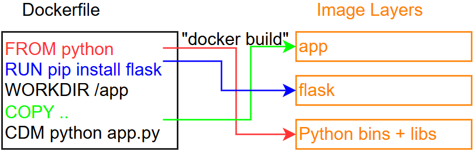
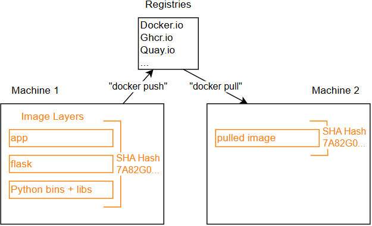
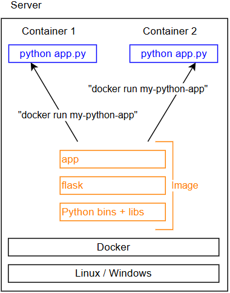
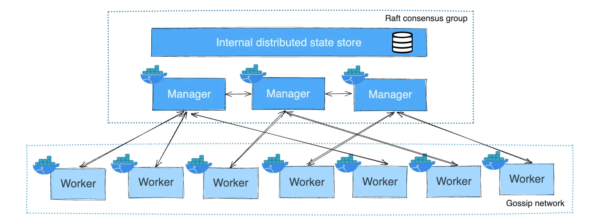
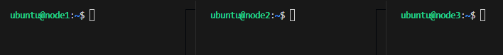
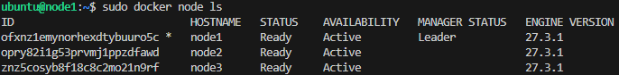
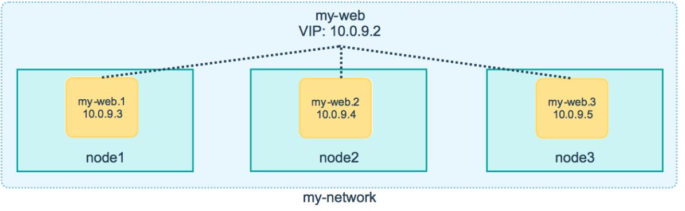
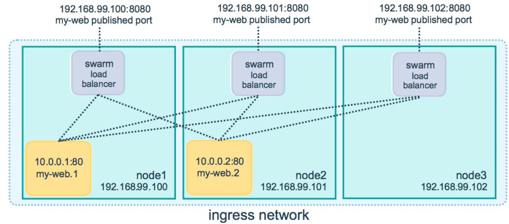
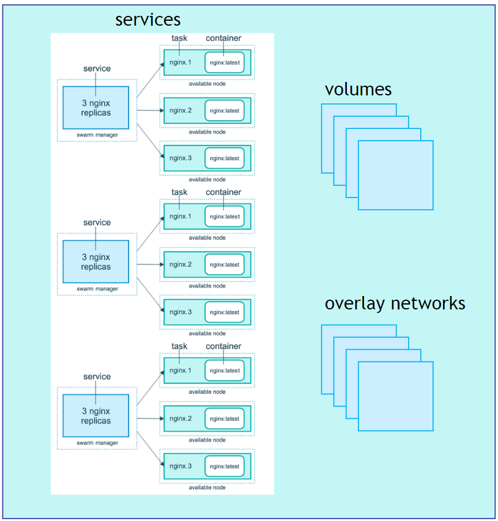

### Definitions

- Docker Image : universal app packager; Dockerfile is the set of instructions needed to create a container/Docker image.

  

  - An image is the application whereas the container is an instance of that image running as a process. One can have many containers running off the same image.

- Docker Registry : universal app distribution (DokerHub), stores docker images and facilitates their distribution. Able to take the software made on one machine with all of its dependencies and run it exactly the same way on another system (with possibly a different distribution).

  

- Docker Container : Identical runtime environments, isolates applications, prevents the application running on a container from seeing the rest of the operating system (similar to a VM but in reality are restricted processes running on the OS kernel).

  

These 3 features implement the docker/container workflow "Build → Ship → Run"

### Online resources

- https://opencontainers.org/
- https://www.docker.com/101-tutorial/
- https://app.docker.com/
- https://www.bretfisher.com/kubernetes-vs-docker/
- https://www.udemy.com/course/docker-mastery

# Docker

## Docker installation

1. download Docker Desktop (tool for cintainer development) from `https://www.docker.com/products/docker-desktop/` note that "Commercial use of Docker Desktop at a company of more than 250 employees OR more than $10 million in annual revenue requires a paid subscription (Pro, Team, or Business)."

   Docker/Container requires the container image to run on a kernel that was designed for it (i.e. linux on linux and windows on windows, etc.); Thus Docker Desktop will manage the setup, upgrading, deletion, and security of a tiny VM (small linux kernel and container file system) transparantly in the background (true for macOS and Windows).

2. install ubuntu from the microsoft store, open it and create a username/password.
3. got to `Docker Desktop > Setting > Resources > WSL Integration` and enable ubuntu (this can be done with any other linux distribution).
4. open ubuntu terminal and run commands to see if successfully downlaoded all. Note that commands will be in the format `docker <managment-command> <sub-command> (options)` (old but still working format `docker <sub-command> (options)`)
   1. `docker version` verified cli can talk to engine
   2. `docker info` displays most config values of engine

### VS Code extensions

- `Docker` https://marketplace.visualstudio.com/items?itemName=ms-azuretools.vscode-docker
- `Kubernetes` https://marketplace.visualstudio.com/items?itemName=ms-kubernetes-tools.vscode-kubernetes-tools
- `Remote Development` https://marketplace.visualstudio.com/items?itemName=ms-vscode-remote.vscode-remote-extensionpack
- `Live Share` https://marketplace.visualstudio.com/items?itemName=MS-vsliveshare.vsliveshare

## Container Basics

The command `docker container run --publish 80:80 --detach --name helloWorld nginx`

1. Looks for the specified image, `nginx`, locally in image cache, doesnt find anything.
2. Looks in remote image repository (defaults to Docker Hub)
3. Downloads the latest version (`nginx:latest` by default)
4. Creates a new container based on that image inside docker engine (with name `helloWorld`). Note that names have to be unique
5. Gives it a virtual IP on a private netwrok inside docker engine
6. Opens up port `80:` on host and forwards to port `:80` in container
7. Starts conainer by using the CMD in the image Dockerfile

Run a `nginx`, `mysql`, and `httpd` (apache) server all in `--detach` and name them appropriately. nginx should listne on `80:80`, mysql on `3306:3306`, and httpd on `8080:80`. When running mysql, pass in `MYSQL_RANDOM_ROOT_PASSWORD=yes`, and use the `docker container logs` on mysql to find the random password it created on startup. Clean it all up with `docker container stop` and `docker container rm` (both can accept multiple names or IDs). Use `docker container ls` to ensure everything is correct before and after cleanup.

1. `docker container ls`
2. `docker container run -p 80:80 --name nginx -d nginx`
3. `docker container run -p 8080:80 --name httpd -d httpd`
4. `docker container run -p 3306:3306 --name mysql --env MYSQL_RANDOM_ROOT_PASSWORD=yes -d mysql`
5. `docker container logs mysql | grep "PASSWORD"`
6. `docker container ls`
7. `docker container stop nginx httpd mysql`
8. `docker container rm nginx httpd mysql`

`docker container run -it` starts a container interactively while `docker contianer exec -it` connects to a shell inside of an already running container.

Use different linux distro (`centos:7` and `ubuntu:14.04`) containers to check curl cli tool version (using `-it` and `docker container run --rm`).

1. `docker container run --rm` "Automatically remove the container and its associated anonymous volumes when it exits" (using `docker container run --help`)
2. `docker container run --rm -it centos:7 bash`
   - `$ curl --version` (already updated/installed)
3. `docker container run --rm -it ubuntu:14.04 bash`
   - `$ apt-get update && apt-get install curl` (needs to be installed)
   - `$ curl --version`

### Docker Networks

Ever since Docker engine 1.11, multiple containers on a created network can respond to the same DNS address. This meanas that a DNS Round Robin can be created. To do this, create a new virtual network (default bridge driver) and create 2 containers from `elasticsearch:2` image. Use `--network-alias search` when creating them to give them an additional DNS name to respond to. Run `alpine nslookup search` to see the 2 containers list for the same DNS name. Run `alpine curl -s search:9200` multiple times until you see both "name" fields show.

1. `docker network create --driver bridge round_robin_dns` creates a new virtual network with the default "bridge" driver (builds virtual network locally with its own subnet at 172.17.\*, 172.18.\*, ...).
   - `docker network ls` lists all netwroks, ensures that the netwrok was indeed created.
2. `docker container run --network-alias search --network round_robin_dns --name container1 -d elasticsearch:2` creates and run container in the background with the network alias of "search" connected straight to the "round_robin_dns" local network.
3. `docker container run --name container2 -d elasticsearch:2` creates and run container in the background NOT connected to the "round_robin_dns" local network (aliases are only supported for user-defined networks).
4. `docker network connect --alias search round_robin_dns container2` connects the un-connected container2 to the "round_robin_dns" local network with the alias "search".
   - `docker network inspect round_robin_dns` displays network information for "round_robin_dns", ensures that both containers are connected to the created local network. NOTE THE "IPv4Address" OF EACH CONTAINER.
5. `docker container run --rm --network round_robin_dns -it alpine sh` create an interactive shell container using alpine (linux) that is connected to the user-defined network "round_robin_dns" (so will have access to DNS containing the containers with their alias "search").
   - `$ nslookup search` "Query DNS about HOST", the displayed "Address" should match the containers'
6. - `$ apk update; apk upgrade; apk add curl` to install `curl` on `alpine`
   - `$ curl -s search:9200` x n or until name variable is different (meaning that a different container was accessed)
   - `$ exit`
7. `docker network disconect round_robin_dns container1` disconnects the connected container1 from the "round_robin_dns" local network.
8. `docker container stop container1 container2` stops the running containers.
9. `docker container rm container1 container2` removes the containers.
10. `docker network rm round_robin_dns` removes the user-defined network.

## Image Basics

Every image starts from the very beginning with a blank layer called "scratch"; then, every set of changes that happens after that on the file system, in the image, is another layer (can be seen by running `docker history image:latest`). These layers are only ever stored once on the file system, meaning that images which use the same layers share them (upload/download only missing layers).

When running a container off of an image, Docker creates a new read/write layer for that container ontop of the image. The storage drive that is used by Docker layers these changes ontop of each other to create the final image/container. When a container/layer changes files from the underlying layers, Docker copies and stores the changed files in the container layer (copy-on-write)

`docker image inspect image` returns the image's metadata.

https://docs.docker.com/reference/dockerfile/

"Dockerize a Node.js app". Make a Dockerfile, Build it, Test it, Push it, (rm it), Run it (iterative process).

```Dockerfile
FROM node:6-alpine
EXPOSE 3000
RUN apk add --no-cache tini
WORKDIR /usr/src/app
COPY package.json package.json
RUN npm install && npm cache clean --force
COPY . .
CMD [ "/sbin/tini", "--", "node", "./bin/www" ]
```

- `docker image build -t testnode .` BUILD
- `docker container run -p 80:3000 --rm testnode` TEST
- `docker tag testnode rashri/testnode` change tag to fit username
- `docker push rashri/testnode` upload image to repository
- `docker image rm rashri/testnode` delete local image
- `docker container run -p 80:3000 --rm rashri/testnode` test container works when installing it from repository

### Re-taging images

1. `docker image tag ubuntu:14.04 rashri/ubuntu:14.04` creates a tag TARGET_IMAGE that refers to SOURCE_IMAGE
2. `docker push rashri/ubuntu:14.04` uploads image to repository (public)
   - if I want to create a private repository; in dockerHub, create a repository and specify it as private before running the push command

## Docker Volumes, Bind Mount, and Compose

Docker utilises "immutable infrastructure", where containers are re-deployed instead of changed (if an update is required, containers are removed and re-deployed).

Databases/unique data (mmutable) should not be mixed in with application (seperation of concerns) as if they are, each re-deploy will wipe all progress.

This issue is known as "Presistent Data", adn Docker has 2 solutions; "Volume" and "Bind Mount".

### Volumes

Volume creates a specialised location outside of a container Unique File System (will be removed when container is removed), hence maintaining it across container removals/re-deploys. These can be attached to any contaienr, with the container seeing it as a normal file path. This can be done:

- In Dockerfile, `VOLUME <path>` is used to setup a new volume location and assing it to the specified `<path>` directory in the container (all files within `<path>` will outlive the container, and require manual deletion).

- By adding `-v <name>:<path>` within the `docker container run` command allows the addition of a named-volume (use friendly-name for ease of use).

- By using the `docker volume create` command allows the specifying of volume drivers.

### Bind Mount

Bind Mount links the container path to the host machine's path, with the container seeing it as a normal file path (two locations pointing at the same file(s)). Host files overwrite any in container.

This can only be done at the `docker container run` command (no in Dockerfile) using the absolute path of host instead of the name `-v <host-path>:<container-path>`

"Containerize Jekyll". Follow the requirments and instructions for https://jekyllrb.com/ so that a jekyll website can be entered as a bind mount (file/directory on host machine is mounted into a container).

Dockerfile :

```Dockerfile
FROM alpine:latest

# Prerequisites from https://jekyllrb.com/docs/installation/#requirements
RUN apk update; apk upgrade; apk add build-base ruby-dev ruby
# install the jekyll and blunder gems
RUN gem install jekyll bundler && gem cleanup
# copy entrypoint bash script to local
COPY entrypoint.sh /usr/local/bin
# enter volume where jekyll site was created
WORKDIR /site
EXPOSE 4000
# run the bash script which would run bundle install
ENTRYPOINT [ "entrypoint.sh"]
# run the command bundle exec jekyll serve --force_polling -H 0.0.0.0 -P 4000
CMD [ "bundle", "exec", "jekyll", "serve", "--force_polling", "-H", "0.0.0.0", "-P", "4000" ]
```

entrypoint.sh :

```bash
#!/bin/sh
bundle install --retry 5 --jobs 20;
exec "$@"
```

- `docker image build -t jekyll .`

Then for operating the containers:

- `docker container run --rm -it -p 80:4000  -v ${pwd}/myblog:/site rashri/jekyll`

or

using a `docker-compose.yml` file:

```yml
version: "2"

services:
  jekyll:
    build: .
    image: rashri/jekyll
    volumes:
      - ./myblog:/site
    ports:
      - "80:4000"
```

Run

- `docker compose up` to spin-up the services
- `docker compose down` to clean-up the services

### Compose

A combination fo a command line tool (`docker compose`) and a configuration file (YAML like above) which allows docker to configure relationships between containers, save the container run settings in an easy-to-read file, and easily run it.

# Orchestration

## Docker Swarm

Swarm mode is a clustering solution built inside Docker (unrelated to Swarm "classic" for pre-1.12 versions). It is not enabled by default, `docker swarm init`

A "Swarm" consists of one or more nodes, each a VM/pysical-host runnning a distribution of Linux/Windows/etc. running Docker Engine.



Manager nodes have a locally stored database, called the "Raft Database", that stores their configuration and gives them all the information they need to have to be the authority inside a swarm. Each keeps a copy of that database and encrypts their traffic in order to ensure integrity and guarantee the trust that they are able to manage this swarm securely.

Managers issue orders (communicating over the "Control Plane") down for the Worker nodes to complete (managers themselves can also be workers, can be thought of as a Worker with permissions to control the swarm). Workers/Managers can also be demoted/promoted into the two different roles.

### Create a swarm Multi-node cluster (3 nodes with different OSs)

_can either be entirely through a ubuntu shell or on host machine using Multipass Desktop app and Oracle Virtual Machine, following the exact same steps_

1. `sudo snap install multipass` (same as installing multipass and virtualbox)
2. Create multipass node with Docker: (`X` should be replace with number identifying between the different nodes)
   1. run `multipass launch -n nodeX` to create a VM shell.
   2. Install Docker onto nodeX: (follow https://docs.docker.com/engine/install/ubuntu/)
      1. run `multipass transfer dockerInstaller.sh nodeX:/home/ubuntu/` to pass the shell commands to set up Docker's Apt repository and (final line in .sh) install the latest version.
      2. run `multipass shell nodeX` to enter the VM shell.
      3. run `./dockerInstaller.sh` to run the bash commands.
      4. run `sudo docker run hello-world` to ensure that the Docker Engine installed successfully.
3. Repeat 2. three times to create a total of 3 nodes.
4. run `multipass shell node1` to enter the VM shell "node1".
5. run `sudo docker swarm init` to initialise a swarm. This will return a command similar to `docker swarm join --token SWMTKN-1-4njjqwo1zb6dmuzsqa1g7uy51n7q7vitvqo9g1cr6l3ro7v1mi-c5j9j7or3i7bap6r1rlp4swmv 10.156.135.175:2377` (will be referenced as `<docker swarm join command>`)
6. `^D` to logout of node1.
7. Adding a node as workers to the created swarm.
   1. run `multipass shell nodeX` to enter the VM shell.
   2. run `sudo <docker swarm join command>` to add nodeX as a worker to the swarm
   3. run `^D` to logout of nodeX.
8. Repeat 7. for node2 and node3.

#### Promote and Demote nodes

concurrently enter all nodes: (run `multipass shell nodeX`, will make changes easier)


- run `sudo docker node update --role manager node2` inside `ubuntu@node1` to promote `node2` from a worker to a manager (cannot be leader as only one manager can be leader at a time).
- run `sudo docker swarm join-token manager` inside `ubuntu@node1` to get the command required by a node to enter the swarm as a manager (remember to `sudo` `docker swarm join --token SWMTKN-1-4njjqwo1zb6dmuzsqa1g7uy51n7q7vitvqo9g1cr6l3ro7v1mi-4drh3knfo5nizws91wurtmsj7 10.156.135.175:2377`).
- run `sudo` `docker swarm leave` is used to leave a joined swarm.
- run `sudo` `docker node demote node2` inside `ubuntu@node1` to demote `node2` back to worker.



1. run `docker network create --driver overlay mydrupal` to create a local network for the future services to talk with one another.
2. run `docker service create --name psql --network mydrupal -e POSTGRES_PASSWORD=mypass postgres:14` to start a postgresql service.
3. run `docker service create --name drupal --network mydrupal -p 80:80 drupal:9` to start a drupal service.

#### Open vm ports to host

(help from https://dev.to/arc42/enable-ssh-access-to-multipass-vms-36p7)

1. run `ssh-keygen -C ubuntu -f multipass-ssh-key` to generate a key pair for ssh.
2. create cloud-init.yaml file:
   ```yaml
   users:
     - default
     - name: ubuntu
       sudo: ALL=(ALL) NOPASSWD:ALL
       ssh_authorized_keys:
         - <public key from .pub file>
   ```
   Note that `-C` and `name:` both use `ubuntu` as this is the default user created & used by multipass (must be used so multipass commands will act on the correct user).
3. run `multipass launch -n nodeX --cloud-init cloud-init.yaml` to start a VM shell with the cloud-init configuration.
4. run `multipass ls` to find the IPv4 address of `nodeX`, referenced as `<ip-address>`.
5. run `sudo ssh ubuntu@<ip-address> -i multipass-ssh-key -o StrictHostKeyChecking=no -L 8080:<ip-address>:80` to connect port `8080` of host machine (localhost) to port `80` of `nodeX`.

Note that this was tested using `apache2`, achieved by running `sudo apt update; sudo apt install apache2; sudo systemctl start apache2` inside `nodeX` (through either `sudo ssh ubuntu@<ip-address> -i multipass-ssh-key -o StrictHostKeyChecking=no` or `multipass shell nodeX`)

### Overlay Multi-Host Networking

`--driver overlay` network allows for container-to-container traffic inside a single swarm (optional IPSec, AES, encryption on network creation). Works similar to `--driver bridge` with each service capable of connecting to multiple networks.

The **Routing Mesh** spans all the nodes in the swarm (uses IPVS, Linux Kernel primitives); and allows for routes ingress of incoming pockets for a service to its proper task (service is available through all nodes even though only running on one).

- Containers do not communicate directly to one another's IP adresses; instead they would talk to a Virtual IP address (VIP) that Swarm places infront of all services (private IP inside the virtual network of Swarm). This ensures that the load is distributed amongst all the tasks for a service.
  
- External traffic incoming to published ports can choose to hit any of the nodes in the Swarm. Worker nodes then have all of the Swarrm's published ports open and listnening for that container's traffic; and will reroute that traffic to the propoer container based on its load balancing.
  

### Stack

A new layer of abstraction to Swarm was introduced in Docker 1.13.0; Stack. Stack accept compose files as their declarative definition for services, networks, and volumes (also secrets); created using `docker stack deploy` command (includes overlay network per stack). The only differnece between Stack and Compose files is that Stack cannot do `build` (ignores it) while Compose cannot do `deploy` (ignores it):

```yml
version: "3" # has to be >=3 to use stack

services:
  jekyll:
    build: .
    image: rashri/jekyll
    volumes:
      - ./myblog:/site
    ports:
      - "80:4000"
    deploy:
      replicas: 3
      update_config:
        parallelism: 2
        delay: 10s
      restart_policay:
        condition: on-failure
      placement:
        contraints: [node.role == manager]
```



#### Secrets Storage

As of Docker 1.13.0 Swarm Raft DB is encrypted on disk, only stored on disk on Manager nodes (Default is Managers and Workers "control plane" TLS + Mutual Auth). Secrets are first stored in Swarm, and then assigned to a Service(s), and are only seen by them. These look like files in container but are actually in-memory filesystem (`/run/secrets/<secret_alias>`). Local docker-compose can use file-based secrets, but is not secure.

Storing the secret in Swarm can be done in two ways:

1. passing a file through: `docker secret create <name> <file_name_with_secret>` (storing secret on hard drive of the server on the host, should user remoteAPI from the local command line on machine and then pass in the files that way)
2. passing value at command-line: `echo <secret> | docker secret create <name> -` (secret is going into the history of bash file for root user so if someone gets root credentials, they can get access to the secret). Note that this will then be treated as a file in /run/secrets/.

Assigning secrets to a service can be done through using `docker service create <...> --secret <name> <...>`, which maps the secret to the service so it appears as files inside the container (doesnt tell the service how to use this secret). The offical images from DockerHub settled on a standard that for environment variables, `-e <environment_varaible_name>_FILE=/run/secrets/<name>` is used. This makes it so that during the startup of the image (where it will look for the environment variable) it will pull that file's contents out and use that for the environment variable. This can be also done in a Stack file:

```yml
version: "3.1" # has to be >=3.1 to use secrets

services:
  psql:
    image: postgres
    secrets:
      - psql_user
      - psql_password
    environment:
      POSTGRES_PASSWORD_FILE: /run/secrets/psql_password
      POSTGRES_USER_FILE: /run/secrets/psql_user

secrets:
  psql_user:
    file: ./psql_user.txt
  psql_password:
    external: true # when secret is created outside of the compose file
```

## Kubernetes

multipass launch -n node1;multipass launch -n node2;multipass launch -n node3;multipass transfer dockerInstaller.sh node1:/home/ubuntu/;multipass transfer dockerInstaller.sh node2:/home/ubuntu/;multipass transfer dockerInstaller.sh node3:/home/ubuntu/
